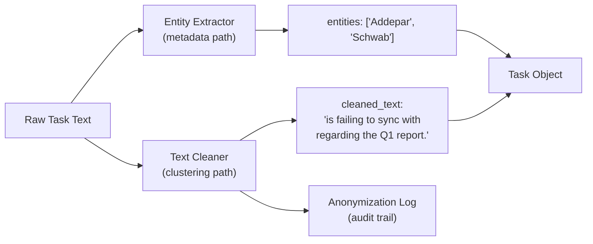

# Plan: Preprocessing & Extraction Pipeline

## Design Principle

Two parallel paths from the same raw text:



**Entity Extractor** identifies platforms/custodians/entities and tags them as metadata. **Text Cleaner** removes those same entities from the text so the embedding model clusters on operational intent. **Anonymization Log** records every removal for auditability -- catch over-aggressive cleaning.

---

## File Structure

```
asana-classification-v2/
  pipeline/
    __init__.py
    config.py              # Loads entities.yaml, exposes config
    entities.yaml          # All monitored platforms, custodians, orgs
    extractor.py           # Entity extraction (regex)
    cleaner.py             # Text cleaning/masking for clustering
    preprocessor.py        # Orchestrator: raw text -> {original, cleaned, entities, log}
  tests/
    test_pipeline.py       # Unit tests
  preprocess.py            # Main script: reads Client_support.csv, runs pipeline
  outputs/
    corpus_clean.csv       # Final preprocessed output
    anonymization_log.csv  # Audit log of all entity removals
```

---

## Phase 1: Entity Configuration (`pipeline/entities.yaml`)

```yaml
platforms:
  portfolio:
    - Addepar
    - Addepar - EU
    - Arch
    - Venn
    - NINES
  document:
    - Egnyte
    - SharePoint
  data_aggregator:
    - Orca
    - Plaid
    - ByAll
  client_portal:
    - Epicc
  crm:
    - Salesforce
    - SFDC
  accounting:
    - KnowLedger
    - QuickBooks
  project_management:
    - Asana

custodians:
  - Schwab
  - Fidelity
  - Goldman Sachs
  - Goldman
  - Morgan Stanley
  - Pershing
  - Raymond James

banks:
  - JPMorgan
  - Wells Fargo
  - Citi
  - Bank of America
  - BofA

advisor_orgs:
  - Mosaic
  - Elevate
  - TOS
  - SAOS
```

---

## Phase 2: Entity Extractor (`pipeline/extractor.py`)

```python
class EntityExtractor:
    def __init__(self, config_path: str = "pipeline/entities.yaml"):
        # Load YAML, compile regex patterns (longest-first, word-boundary)

    def extract(self, text: str) -> list[dict]:
        """
        Returns: [
            {"entity": "Addepar", "category": "platform.portfolio", "span": (0, 7)},
            {"entity": "Schwab", "category": "custodian", "span": (34, 40)},
        ]
        """
```

Key details:

- Single compiled regex alternation, longest-first
- Word-boundary matching, case-insensitive
- Arch edge case: negative lookahead for "itect", "ive", "ival"
- Deduplicate overlapping spans (keep longest)

---

## Phase 3: Text Cleaner (`pipeline/cleaner.py`)

```python
class TextCleaner:
    def __init__(self, extractor: EntityExtractor):
        self.extractor = extractor

    def clean(self, text: str, entities: list[dict]) -> tuple[str, list[dict]]:
        """
        Returns: (cleaned_text, anonymization_log_entries)
        """
```

Removal strategy:

1. Remove entity text by span, collapse whitespace
2. Clean orphaned prepositions/conjunctions at boundaries
3. No placeholder tokens -- just clean removal
4. Return log entries for every removal

---

## Phase 4: Anonymization Log

Every entity removal is recorded in a structured log entry:

```python
{
    "task_id": "row_index_or_name",
    "original_text": "Error 505 in Arch",
    "entity_removed": "Arch",
    "category": "platform.portfolio",
    "span": (13, 17),
    "context_before": "505 in Arch",       # 10 chars before + entity + 10 chars after
    "cleaned_text": "Error 505 in",
    "flag": "trailing_preposition"          # optional warning flag
}
```

**Flags** for automatic quality alerts:

- `trailing_preposition` -- removal left orphaned "in", "to", "from", "with" at end
- `short_result` -- cleaned text is <10 chars (may have lost too much context)
- `adjacent_removal` -- two entities removed within 3 words of each other (potential context loss)
- `numeric_adjacent` -- entity was next to a number (could be error code, version, etc.)

Output: `outputs/anonymization_log.csv` -- scan this after a run to spot over-aggressive cleaning. Example review:

```
task_id | original_text              | entity_removed | cleaned_text      | flag
--------|----------------------------|----------------|-------------------|------------------
142     | Error 505 in Arch          | Arch           | Error 505 in      | trailing_preposition
891     | Arch v3.2 migration failed | Arch           | v3.2 migration failed | numeric_adjacent
```

---

## Phase 5: Orchestrator (`pipeline/preprocessor.py`)

```python
class TaskPreprocessor:
    def __init__(self, config_path: str = "pipeline/entities.yaml"):
        self.extractor = EntityExtractor(config_path)
        self.cleaner = TextCleaner(self.extractor)

    def process(self, text: str, task_id: str = None) -> dict:
        """
        Returns:
        {
            "original_text": "Addepar is failing to sync with Schwab...",
            "cleaned_text": "is failing to sync with regarding the Q1 report.",
            "entities": [{"entity": "Addepar", "category": "platform.portfolio"}, ...],
            "primary_platform": "Addepar",
            "secondary_platform": "Schwab",
            "anonymization_log": [...]
        }
        """

    def process_dataframe(self, df, text_col) -> tuple[pd.DataFrame, pd.DataFrame]:
        """Returns: (processed_df, anonymization_log_df)"""
```

---

## Phase 6: Main Script (`preprocess.py`)

Pipeline steps:

1. Read `Client_support.csv`
2. Filter rows (sub-tasks, bots, empty)
3. Extract form fields
4. PII masking (client names -> `[CLIENT]`, emails -> `[EMAIL]`, phones -> `[PHONE]`)
5. Entity extraction + cleaning (via `TaskPreprocessor`)
6. Deduplication
7. Text length filter (15 chars)
8. Output: `outputs/corpus_clean.csv` + `outputs/anonymization_log.csv`

---

## Phase 7: Unit Tests (`tests/test_pipeline.py`)

Core test cases:

- Basic extraction and cleaning
- Arch vs architecture edge case
- No entities (text unchanged)
- Multi-platform (primary/secondary assignment)
- Longest-match wins (Goldman Sachs > Goldman)
- Orphaned preposition cleanup
- Anonymization log entries generated correctly
- Flag detection (numeric\_adjacent, short\_result)

---

## Critical Files

- pipeline/entities.yaml - Entity definitions (business config)
- pipeline/extractor.py - Regex entity extraction engine
- pipeline/cleaner.py - Text cleaning with audit trail
- pipeline/preprocessor.py - Orchestrator
- tests/test\_pipeline.py - Unit tests
- preprocess.py - Main script (CSV in -> corpus\_clean.csv + log out)
