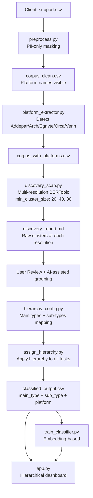
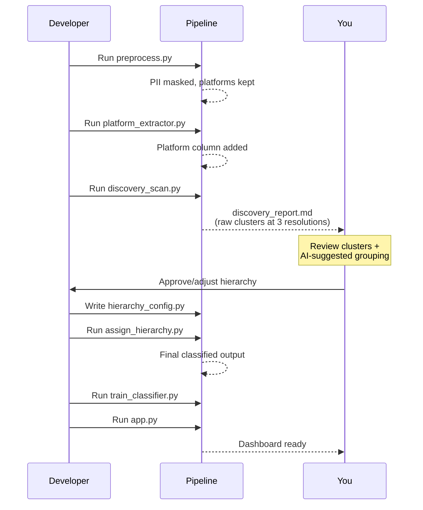

# Plan: Rebuild with Discovery-First Approach

## Design Philosophy

**No zero-shot seeds. No predefined categories. Let the data speak first.**

The pipeline runs BERTopic in pure unsupervised mode at multiple resolutions to discover natural task groupings. Only AFTER reviewing the raw clusters do we organize them into a hierarchy. This prevents the bias of v1 where 15 hand-crafted seeds forced the model into predetermined categories.

---

## Architecture



---

## Multi-Resolution Scan Strategy

Run BERTopic 3 times with different `min_cluster_size` values. Each resolution reveals a different granularity:

| Resolution | min_cluster_size | Expected Clusters | What It Reveals |
|-----------|-----------------|-------------------|-----------------|
| **Fine** | 20 | ~30-50 clusters | Granular sub-types (e.g., "Addepar view column setup" vs "Arch access grants") |
| **Medium** | 40 | ~15-25 clusters | Operational categories (close to final sub-types) |
| **Coarse** | 80 | ~7-12 clusters | Natural main categories (your target hierarchy top level) |

The coarse resolution gives you the 7-12 main types. The fine resolution shows what sub-types exist within each. The medium is a sanity check in between.

All three share the SAME embeddings (computed once, reused) -- so the scan takes ~3 minutes total, not 3x.

---

## Phase Details

### Phase 1: Preprocessing (No Platform Masking)

**File:** `preprocess.py`

What stays:
- Filter: sub-tasks, KaizenBot tasks, Working Sessions, empty rows
- Form field extraction ("How may we assist you?" -> extracted intent text)
- PII masking: client names -> `[CLIENT]`, emails -> `[EMAIL]`, employee names -> `[EMPLOYEE]`, phones -> `[PHONE]`
- Deduplication (exact + near-duplicate by Jaccard similarity)
- Minimum text length filter (15 chars)

What changes:
- **REMOVE** the entire platform blocklist (`PLATFORM_CATEGORIES` dict)
- Platform names (Addepar, Arch, Egnyte, Goldman, Schwab, etc.) remain in text as-is
- No typed tokens like `[PORTFOLIO_PLATFORM]` -- the text reads naturally

---

### Phase 2: Platform Extraction

**File:** `platform_extractor.py`

Simple regex-based detection for the 5 tracked platforms:

```python
TRACKED = {
    "Addepar": r"\baddepar\b",
    "Arch":    r"\barch\b(?!\s*(itect|ive))",  # avoid "architecture", "archive"
    "Egnyte":  r"\begnyte\b",
    "Orca":    r"\borca\b",
    "Venn":    r"\bvenn\b",
}
```

Logic:
- Scan `complaint_text` for each platform regex
- `primary_platform` = platform with earliest position in text (or most mentions)
- `secondary_platform` = second platform if multiple detected
- `"General"` if no tracked platform found (~15-25% of tasks expected)

---

### Phase 3: Multi-Resolution Discovery Scan

**File:** `discovery_scan.py`

```python
# Shared components (computed once)
embeddings = SentenceTransformer("all-mpnet-base-v2").encode(docs)

# Three HDBSCAN runs at different granularities
RESOLUTIONS = [
    {"name": "fine",   "min_cluster_size": 20},
    {"name": "medium", "min_cluster_size": 40},
    {"name": "coarse", "min_cluster_size": 80},
]
```

For EACH resolution:
1. UMAP reduction (shared: n_neighbors=15, n_components=5, cosine)
2. HDBSCAN clustering (different min_cluster_size)
3. c-TF-IDF keyword extraction + MMR
4. Store: topic_id, keywords, size, sample tasks, confidence

**NO zero-shot seeds. NO target topic count. NO hierarchical reduction.**

Output per resolution:
- `discovery_{resolution}.csv` -- every task with its cluster assignment
- Combined into `discovery_report.md` -- readable comparison table

---

### Phase 4: Discovery Report + AI-Assisted Grouping

**File:** `build_hierarchy.py`

This phase produces a report for your review AND suggests a grouping:

**Part A -- Raw discovery report:**

For each resolution, display:
```
COARSE RESOLUTION (min_cluster_size=80)
═══════════════════════════════════════
Cluster 0 | 412 tasks (15.4%) | Keywords: investment, fund, commitment, entry, position
  Sample: "New private investment entry for Rockpoint Partners VI"
  Sample: "Create new PE fund position in Addepar - Hamilton Lane"

Cluster 1 | 298 tasks (11.1%) | Keywords: account, feed, connection, bank, brokerage
  Sample: "New Goldman Sachs account setup - data feed connection"
  ...
```

**Part B -- AI-suggested hierarchy:**

Use the cluster keywords + samples to suggest how fine-grained clusters nest into coarse ones:

```
SUGGESTED MAIN TYPE: "Private Investments"
  Sub-type: "New Investment Entry" (fine clusters 3, 7, 12)
  Sub-type: "Valuation & Price Updates" (fine clusters 5, 19)
  Sub-type: "Capital Calls & Distributions" (fine clusters 8, 14, 22)
```

You review, adjust, and confirm the mapping. This becomes `hierarchy_config.py`.

---

### Phase 5: Apply Hierarchy

**File:** `assign_hierarchy.py`

Once you approve the hierarchy, this script:
1. Reads the fine-resolution assignments (most granular)
2. Maps each fine cluster -> sub_type -> main_type using `hierarchy_config.py`
3. Handles outliers: assign to nearest cluster by embedding cosine similarity (reduce outlier rate to <3%)
4. Produces final `classified_output.csv` with columns:
   - `main_type` (7-12 categories)
   - `sub_type` (proportional: larger main types get more sub-types)
   - `primary_platform` (Addepar/Arch/Egnyte/Orca/Venn/General)
   - `secondary_platform`
   - `confidence_score`
   - `nearest_cluster_distance` (for quality assessment)

---

### Phase 6: Production Classifier

**File:** `train_classifier.py`

Two-level classification using sentence embeddings:

**Model A -- Main Type Classifier:**
- Input: sentence embeddings (768-dim from mpnet)
- Output: one of 7-12 main types
- Algorithm: Logistic Regression (balanced classes) or small feedforward net
- Expected accuracy: >80% (fewer classes = easier to learn)

**Model B -- Sub-Type Classifier:**
- Input: sentence embeddings + predicted main_type (as feature)
- Output: sub-type within the predicted main type
- Algorithm: per-main-type classifiers OR single multi-class with hierarchical constraint
- Expected accuracy: >70%

**Platform detection stays regex-based** -- no ML needed.

Combined inference:
```python
def classify(text):
    embedding = model.encode(text)
    main_type = main_clf.predict(embedding)     # "Private Investments"
    sub_type  = sub_clf.predict(embedding)      # "Capital Calls & Distributions"
    platform  = extract_platform(text)           # "Addepar"
    return {"main_type": main_type, "sub_type": sub_type, "platform": platform}
```

---

### Phase 7: Dashboard + Validation

**File:** `app.py`

Tabs:
1. **Overview** -- sunburst chart (main_type -> sub_type), platform pie chart
2. **Hierarchy Explorer** -- expandable tree: click main_type to see sub-types, drill to tasks
3. **Platform Matrix** -- heatmap of platform x main_type (volume at each intersection)
4. **Platform Deep Dive** -- filter by platform, see its issue distribution
5. **Classify New Task** -- live 3-dimensional prediction (main_type + sub_type + platform)
6. **Discovery Audit** -- show the multi-resolution scan results for transparency
7. **Quality & Confidence** -- metrics, outlier analysis, comparison vs v1

---

## Verification

| Check | Target | How |
|-------|--------|-----|
| Outlier rate | <3% | Count tasks with no cluster assignment after outlier recovery |
| Main type coverage | 100% of non-outlier tasks | Every task gets a main_type |
| Sub-type coverage | 100% of non-outlier tasks | Every task gets a sub_type |
| Platform detection accuracy | >95% | Manual check of 50 random rows |
| Main type balance | No single type >20%, no type <5% | Distribution check |
| Main classifier accuracy | >80% | Held-out test set + 5-fold CV |
| Sub-type classifier accuracy | >70% | Per-main-type evaluation |
| Cross-platform coherence | Same issue type spans multiple platforms | Cross-tabulation |

---

## Critical Files

- [preprocess.py](preprocess.py) - PII-only masking, platform names preserved
- [discovery_scan.py](discovery_scan.py) - Multi-resolution BERTopic (core discovery engine)
- [build_hierarchy.py](build_hierarchy.py) - AI-assisted grouping + report for user review
- [hierarchy_config.py](hierarchy_config.py) - Approved main_type -> sub_type mapping (user-confirmed)
- [train_classifier.py](train_classifier.py) - Two-level embedding classifier

---

## Workflow Summary



The key insight: there's a **human-in-the-loop checkpoint** between discovery and final classification. You see the raw data patterns before committing to a taxonomy.
