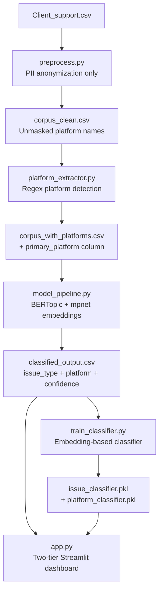

# Plan: Rebuild Asana Classification with Two-Tier Taxonomy

## Context

### Current State
The existing pipeline masks ALL platform names (Addepar, Arch, Egnyte, etc.) with typed tokens like `[PORTFOLIO_PLATFORM]`, `[CUSTODIAN]`, etc. This forces platform-agnostic clustering -- tasks cluster by *operation type* regardless of which platform they reference.

**Problem:** Addepar (41% of tasks) and Arch (37% of tasks) dominate the workload. Stakeholders need to know not just *what* type of issue it is, but *which platform* is involved -- because different platforms have different teams, SLAs, and escalation paths.

### Design Decision: Two-Tier Taxonomy
Each classified task will have TWO dimensions:

| Dimension | Example | Source |
|-----------|---------|--------|
| **Issue Type** | "Data Feed Setup", "View Configuration", "Valuation Update" | BERTopic cluster |
| **Platform** | "Addepar", "Arch", "Egnyte", "Orca", "Venn", or "None/Other" | Regex extraction from raw text |

### Key Change: Unmasked Text for Clustering
Instead of masking platform names, we keep them visible. This allows BERTopic to learn that "Addepar view configuration" and "Arch view configuration" are semantically similar (same issue type) while also enabling us to extract the platform as a separate dimension.

**Why this works better than platform-specific clusters:** A task like "Set up new data feed in Addepar" and "Connect new feed to Arch" are the SAME operational issue (data feed setup) happening on different platforms. A two-tier taxonomy captures both facts without creating an explosion of N_issues x N_platforms clusters.

### Tracked Platforms
- **Addepar** -- portfolio management (41% of tasks)
- **Arch** -- portfolio management (37% of tasks)
- **Egnyte** -- document management (~17%)
- **Orca** -- data aggregator
- **Venn** -- portfolio analytics

All other platform mentions (Goldman, Schwab, Fidelity, etc.) are NOT tracked as a platform dimension -- they remain in the text but are not extracted as a categorical column.

---

## Architecture



---

## Implementation Steps

### Step 1: Rewrite Preprocessing (No Platform Masking)

**File:** `preprocess.py` (new, replaces `preprocess_v2.py`)

Key changes from v1:
- **KEEP** platform names in text (Addepar, Arch, Egnyte, Orca, Venn, Goldman, Schwab, etc.)
- **KEEP** 3-layer PII anonymization: emails -> `[EMAIL]`, client names -> `[CLIENT]`, employee names -> `[EMPLOYEE]`, phone numbers -> `[PHONE]`
- **REMOVE** the entire `PLATFORM_CATEGORIES` blocklist -- no more `[PORTFOLIO_PLATFORM]` tokens
- **KEEP** deduplication logic (4,278 -> ~2,678 unique tasks)
- **KEEP** form field extraction ("How may we assist you?")
- **KEEP** sub-task filtering, bot filtering, minimum text length

Output: `corpus_clean.csv` with columns: `Name`, `complaint_text` (unmasked), `Household`, `Assignee`, `Created At`, etc.

---

### Step 2: Build Platform Extraction Module

**File:** `platform_extractor.py` (new)

```python
TRACKED_PLATFORMS = {
    "Addepar": ["addepar", "addepar - eu"],
    "Arch":    ["arch"],
    "Egnyte":  ["egnyte"],
    "Orca":    ["orca"],
    "Venn":    ["venn"],
}
```

Logic:
1. For each task's `complaint_text`, scan for mentions of tracked platform names (case-insensitive)
2. Assign `primary_platform` = the first/most prominent platform mentioned
3. Assign `secondary_platform` = second platform if multiple are mentioned
4. If no tracked platform detected -> `primary_platform = "General"` (platform-agnostic task)
5. Handle edge cases: "Arch" appearing as substring of other words (use word-boundary regex)

Output: adds `primary_platform`, `secondary_platform` columns to `corpus_clean.csv` -> produces `corpus_with_platforms.csv`

---

### Step 3: Design Zero-Shot Topic Seeds

Seeds will be rewritten for **unmasked text** -- they can now include actual platform names where it helps matching, but primarily focus on the *operational action*:

Proposed seed topics (~17 operational categories):

| # | Issue Type | Seed Description Focus |
|---|-----------|----------------------|
| 1 | New Account & Data Feed Setup | new account, bank feed, custodian connection, brokerage link |
| 2 | Portfolio Platform Account Updates | account update, rename, close, attribute change, Addepar/Arch |
| 3 | New Private Investment Entry | new private investment, fund entry, commitment, direct owner |
| 4 | Private Investment Updates & Valuations | valuation update, price change, unfunded commitment, capital |
| 5 | Capital Call & Distribution Processing | capital call, distribution, wire, payment, confirm receipt |
| 6 | Weekly Capital Call Audit | weekly check, pending capital calls, audit, mark complete |
| 7 | Cost Basis & Data Quality Fixes | cost basis, export, incorrect data, reconcile, quality fix |
| 8 | Document Upload & Filing | document upload, Egnyte, file, archive, K1, statement |
| 9 | Reporting & Performance Analytics | report, PDF, performance, quarterly, benchmark, dashboard |
| 10 | Ownership Structure & Legal Entity Changes | ownership, LLC, trust, beneficiary, legal entity, dissolved |
| 11 | Real Asset & Transaction Audit | real asset, transaction, oil, cash flows, audit |
| 12 | Loan & Lending Account Setup | loan, lender, mortgage, lending, payment |
| 13 | Direct Deal Updates & Unlinked Accounts | direct deal, unlinked, sale, statements |
| 14 | View & Access Configuration | view, viewset, access, permissions, configure, filter, columns |
| 15 | Tax Preparation & Estimated Taxes | tax, estimated taxes, quarterly, annual, K-1, filing |
| 16 | Payroll & Compensation | payroll, salary, compensation, employee payment |
| 17 | General & Ad Hoc Requests | general, ad hoc, miscellaneous, follow up, operational |

---

### Step 4: New BERTopic Pipeline

**File:** `model_pipeline.py` (rewritten)

Key improvements over v1:
- **Embedding model:** `all-mpnet-base-v2` (768-dim) instead of `all-MiniLM-L6-v2` (384-dim) -- better semantic quality for short task names
- **Input text:** unmasked (platform names visible)
- **UMAP settings:** n_neighbors=15, n_components=5, min_dist=0.0, metric=cosine
- **HDBSCAN:** min_cluster_size=35 (slightly lower -- unmasked text has more discriminative vocabulary)
- **Zero-shot similarity threshold:** 0.28 (slightly lower to reduce outliers)
- **CountVectorizer stopwords:** remove `_ANON_STOPWORDS` since we no longer have placeholder tokens; add domain-generic action verbs as stopwords instead
- **Output columns:** `topic_id`, `issue_type` (business label), `primary_platform`, `secondary_platform`, `confidence_score`, `top_keywords`

The pipeline will:
1. Load `corpus_with_platforms.csv`
2. Embed with mpnet
3. Run BERTopic (ZeroShot mode)
4. Apply business labels
5. Merge platform columns into final output
6. Generate visualizations (including platform x issue_type heatmap)
7. Generate cluster summary report

---

### Step 5: Improved Production Classifier

**File:** `train_classifier.py` (rewritten)

Two separate classifiers:

**A. Issue Type Classifier** (primary)
- Features: sentence embeddings from `all-mpnet-base-v2` (768-dim vectors)
- Model: Logistic Regression or LightGBM on embedding features
- Target: `issue_type` column (15-17 classes)
- Expected improvement: embeddings capture semantic similarity that TF-IDF misses for short task names
- Target: >75% accuracy (up from 63%)

**B. Platform Detector** (secondary)
- Simpler: regex-based extraction (same as `platform_extractor.py`)
- No ML needed -- platform names are explicit in the text
- Falls back to "General" when no platform is detected

Combined output:
```python
{"issue_type": "New Private Investment Entry", "platform": "Addepar", "confidence": 0.82}
```

---

### Step 6: Streamlit Dashboard

**File:** `app.py` (rewritten)

Tabs:
1. **Overview** -- total tasks, platform distribution pie chart, issue type distribution
2. **Platform x Issue Type Matrix** -- heatmap showing volume at each intersection
3. **Platform Deep Dive** -- select a platform, see its top issue types, time trends, sample tasks
4. **Issue Type Explorer** -- select an issue type, see which platforms it spans, keywords, samples
5. **Classify New Task** -- live inference with both issue_type + platform prediction
6. **Quality Metrics** -- confidence distribution, outlier analysis, classifier performance
7. **Time Trends** -- issue volume over time, filterable by platform

---

### Step 7: Validation

Run checks:
- Spot-check 20 random tasks per cluster -- are they correctly classified?
- Cross-tabulate: does each issue_type appear across multiple platforms? (Good: issue types should be platform-agnostic)
- Platform coverage: what % of tasks have a detected platform?
- Outlier rate: target <5% (currently 2.8-15.8% depending on run)
- Compare classifier accuracy: v1 (63%) vs v2 (target >75%)
- Generate `validation_report.txt`

---

## Verification Plan

1. **Preprocessing correctness:** Confirm platform names remain in `corpus_clean.csv`; confirm PII (emails, client names) is still masked
2. **Platform extraction accuracy:** Manually check 50 rows -- does `primary_platform` match the actual platform mentioned?
3. **Cluster quality:** Review `cluster_summary_report.md` -- are clusters semantically coherent? Do keywords make sense?
4. **Two-tier coherence:** Cross-tabulate issue_type x platform -- verify that the same issue type appears across multiple platforms (not platform-locked)
5. **Classifier accuracy:** Test set accuracy >75%, mean confidence >0.60
6. **Dashboard functionality:** All 7 tabs render without errors; live classification returns both dimensions

---

## Critical Files

- [preprocess.py](preprocess.py) - New preprocessing without platform masking
- [platform_extractor.py](platform_extractor.py) - Platform detection module
- [model_pipeline.py](model_pipeline.py) - Core BERTopic pipeline (most complex rewrite)
- [train_classifier.py](train_classifier.py) - Embedding-based classifier
- [app.py](app.py) - Streamlit dashboard with platform dimension

---

## Risk Mitigation

| Risk | Mitigation |
|------|-----------|
| Unmasked text clusters by platform name instead of issue type | Zero-shot seeds emphasize operational vocabulary; platform names become features but not the dominant signal |
| "Arch" matches unrelated words (e.g., "architecture") | Word-boundary regex: `\bArch\b` with negative lookbehind for common false positives |
| Fewer clusters with unmasked text (all Addepar tasks collapse) | Monitor; if needed, increase min_cluster_size or add more seeds |
| Embedding model (mpnet) is 2x slower | Acceptable tradeoff for 768-dim quality; ~60-90s on CPU for ~3K docs |
| Multi-platform tasks ambiguous | Assign primary by position (first mention); expose secondary_platform for reporting |
